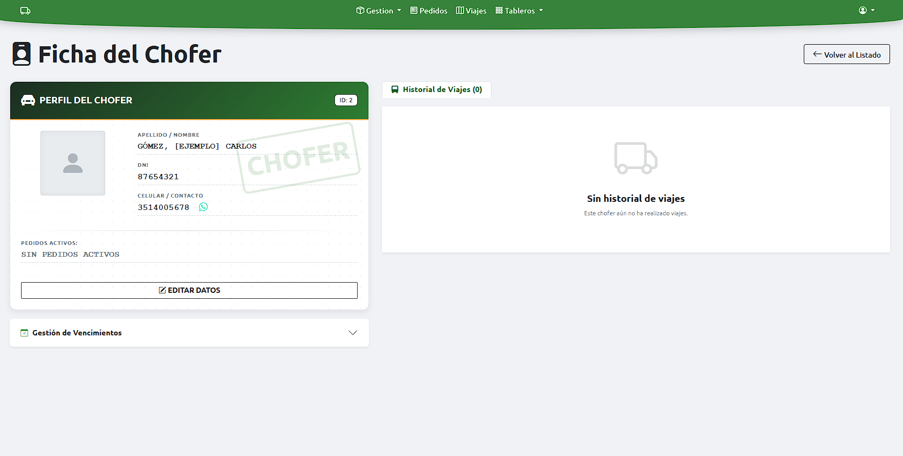
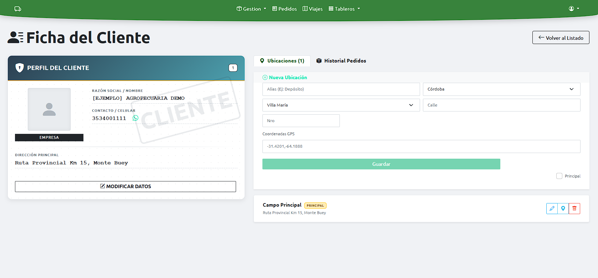
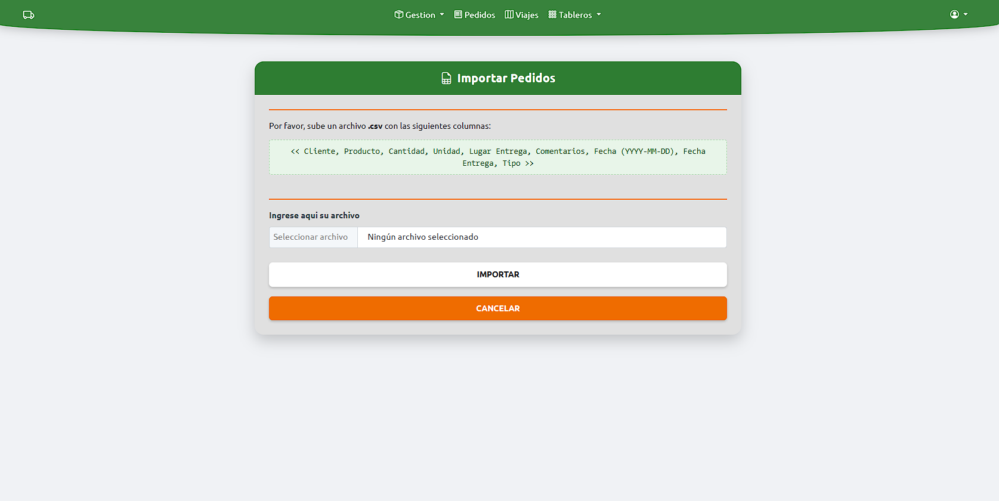
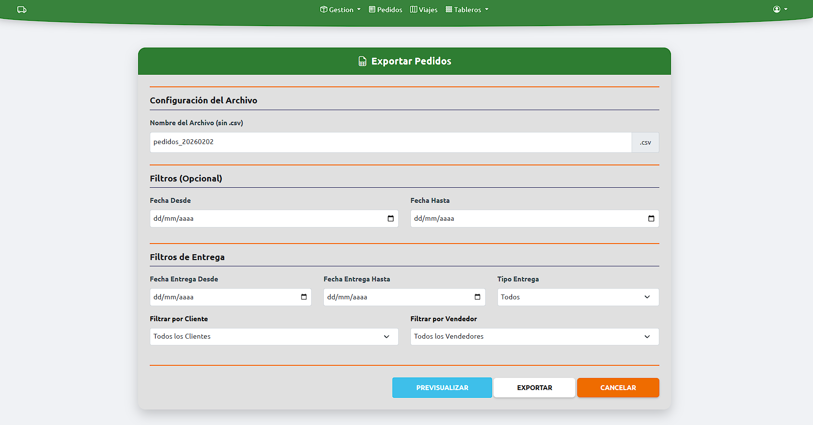
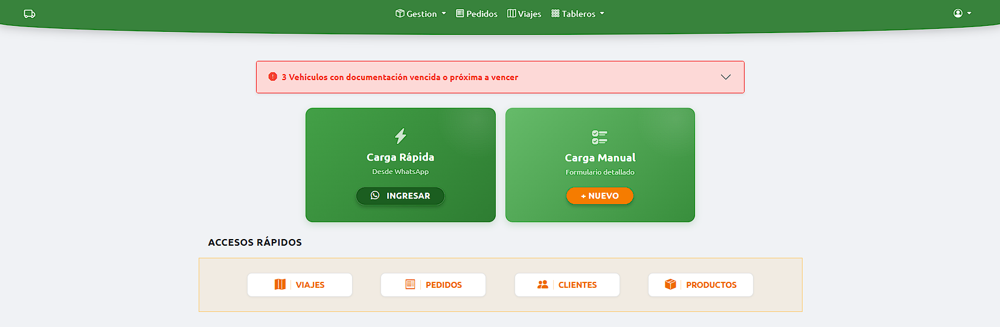
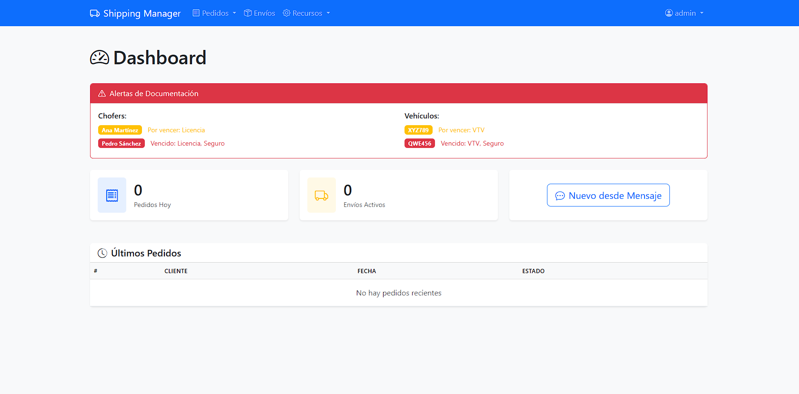
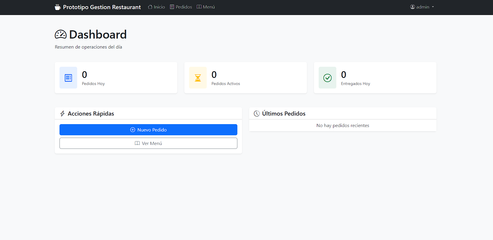
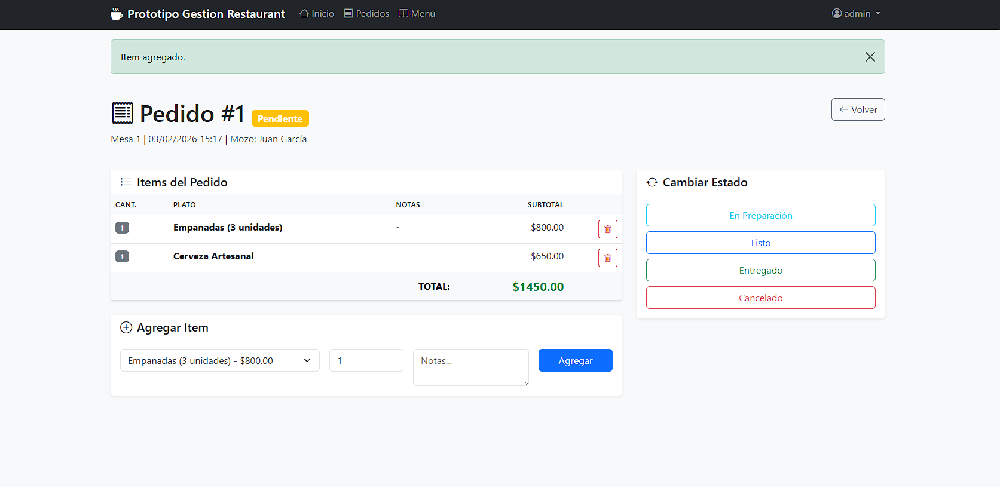

# Arquitectura Modular para Negocios

> **Un sistema, múltiples soluciones.** De la gestión gastronómica a la logística de transporte.

El objetivo de este repositorio es demostrar cómo una **arquitectura de software sólida y bien diseñada** puede adaptarse a modelos de negocio radicalmente opuestos sin reescribir el núcleo del sistema.

Utilizando **Python (Flask)** y patrones de diseño, desarrollé un "Core" que maneja:
* Autenticación y Seguridad.
* Manejo de Base de Datos y Migraciones.
* Manejo de Errores Centralizado: Controladores globales para excepciones (404, 500) y feedback al usuario mediante Flash Messages.

Sobre esta base, construí **tres implementaciones** distintas para probar su versatilidad.

---

##  El Caso llevado a la realidad: Una aplicacion Web de Logistica
*Implementación a medida en Producción para empresa de Insumos Agropecuarios.*

Esta es la versión más compleja y completa del sistema. Se personalizó el núcleo para resolver problemas de **rutas, vencimientos legales y gestión de flota**.

| Funcionalidad Clave | Solución Técnica |
| :--- | :--- |
| **Entrada de Datos** | Parsing de pedidos vía WhatsApp usando **Regex**. |
| **Geolocalización** | Integración con APIs de mapas para hojas de ruta. |
| **Manejos de CSV** | Lectura de archivos CSV para importar datos anteriores / Exportacion de datos en csv para ser llevados a otros sistemas/aplicaciones. |
| **Documentación** | Sistema de alertas preventivas (Semáforo de vencimientos). |

> **Capturas del Sistema en Producción (Datos a modos de ejemplo):**
>
> | 
> | 
>
> *Nota: Se observa la personalización del sistema para la empresa.*

---

## Prototipo A: Modelo Logístico Estandarizado (Base Genérica)
*Estructura fundamental para la administración de transporte y distribución.*
Este prototipo representa la abstracción pura del negocio logístico. A diferencia de la versión productiva (que tiene reglas complejas del agro), esta instancia implementa el **esquema relacional estándar** aplicable a cualquier organización del rubro.

Su objetivo es validar que el núcleo del sistema soporta las relaciones críticas de cualquier flujo de transporte sin necesidad de modificaciones estructurales:

- **Entidades Core:** Gestión vinculada de `Clientes`, `Productos`, `Pedidos`, `Envíos`, `Choferes` y `Vehículos`.
- **Versatilidad:** Este modelo de datos sirve como "plantilla en blanco" para iniciar proyectos en empresas de fletes, distribuidoras mayoristas o servicios de entrega, permitiendo escalar las reglas de negocio según la necesidad específica.

> [Link del prototipo](https://demo-logistica.vercel.app/)

> 
> *Vista del panel de administración genérico adaptable a distintos flujos operativos.*

---

##  Prototipo B: Gestión Gastronómica
*Prueba de concepto para el sector de servicios.*

Utilizando la misma base tecnológica, se adaptaron los modelos de datos para gestionar un restaurante. Lo que antes eran "Camiones y Choferes", aquí se transformaron en lógica de **"Mesas y Meseros"**.

**Entidades del Modelo:**
* **Menú Digital:** Categorización de platos y precios.
* **Mesas:** Estado en tiempo real (Libre/Ocupada/Reservada).
* **Comandas:** Flujo de pedido Cliente -> Cocina -> Entrega.

 [Link del prototipo](https://demo-restaurant-rust.vercel.app/)

> **Capturas del Prototipo:**
>
>  | 
>
> *Aquí se demuestra la flexibilidad del Frontend para adaptarse a una UI de servicio rápido.*

---

## Potencial y Escalabilidad
Esta arquitectura demuestra que, con una base sólida de **Ingeniería de Software**, el costo de desarrollar nuevas soluciones se reduce drásticamente.

### Hoja de Ruta (Roadmap)
El sistema está preparado para evolucionar hacia:
1.  **Modelo SaaS (Software as a Service):** Una sola instancia que sirva a múltiples empresas (Multi-tenant), separando datos por esquemas.
2.  **API:** Desacoplar el Frontend actual para permitir el desarrollo de **Apps Móviles Nativas** (React Native / Flutter) que consuman este mismo Backend.
3.  **Módulos de IA:** Implementar modelos predictivos para estimar la demanda en el restaurante, predecir mantenimiento de camiones en la logística, optimizacion de clientes y zonas geograficas de mayor demanda.

---

## Stack Tecnológico Compartido
Todas las implementaciones comparten este ADN técnico, garantizando calidad y seguridad:

* **Core:** Python 3.11 + Flask (Application Factory Pattern).
* **Datos:** PostgreSQL + SQLAlchemy (ORM).
* **DevSecOps:** Docker, GitHub Actions (CI/CD), Bandit (Seguridad).
* **Frontend:** Bootstrap 5 + Jinja2 (Adaptable por módulos).

---

### Contacto
**Román Medina Ibarra**
*Estudiante de Ingeniería en Sistemas | [Email](mailto:romanmedina016@gmail.com)
